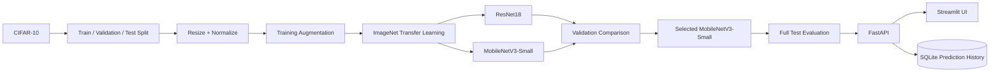
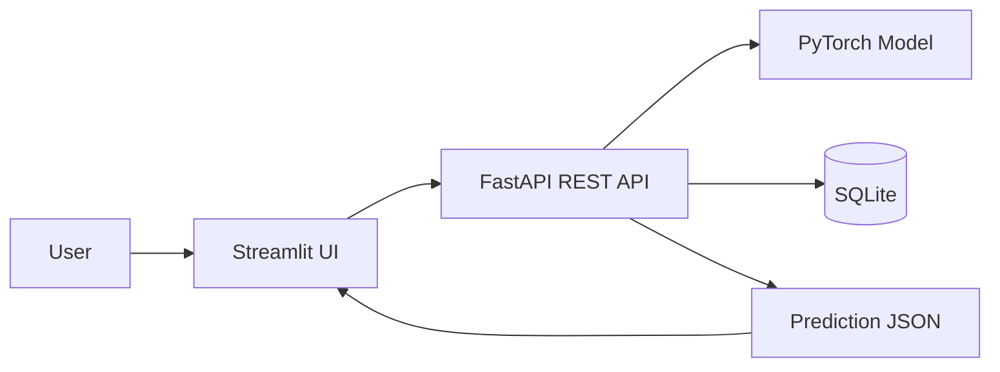

# AI-Powered Image Classification Platform

An end-to-end deep-learning image classification platform built with **PyTorch, CIFAR-10, transfer learning, FastAPI, Streamlit, and SQLite**.

The platform trains and compares two pretrained CNN architectures, evaluates the selected model on the full CIFAR-10 test set, exposes predictions through a REST API, and provides a browser-based interface with confidence scores and prediction history.

## 🚀 Project Highlights

- **Public dataset:** CIFAR-10 (60,000 color images, 10 classes)
- **Preprocessing:** resize, normalization, and training-time augmentation
- **Models compared:** ResNet18 and MobileNetV3-Small
- **Transfer learning:** ImageNet-pretrained backbones with classification heads
- **Evaluation:** Accuracy, Precision, Recall, F1-score, Top-5 Accuracy, Confusion Matrix
- **Backend:** FastAPI REST API with Swagger/OpenAPI documentation
- **Frontend:** Streamlit image-upload application
- **Prediction history:** SQLite database
- **Deployment:** Docker and Docker Compose configuration
- **Testing:** automated API tests with pytest
- **Trained model:** saved PyTorch `best_model.pt`

## 🌐 Live Deployment

- **Live Streamlit Demo:** https://ai-image-classification-platform-czhqd2rj4edkmhzyknxx4.streamlit.app
- **Live FastAPI Backend:** https://ai-image-classification-platform.onrender.com
- **Live Swagger API Docs:** https://ai-image-classification-platform.onrender.com/docs
- **API Health Check:** https://ai-image-classification-platform.onrender.com/health

The deployed Streamlit frontend sends image prediction requests to the deployed FastAPI backend.

## 📊 Final Results

The final selected model was **MobileNetV3-Small**.

| Metric | Result |
|---|---:|
| Accuracy | **80.93%** |
| Weighted Precision | **81.74%** |
| Weighted Recall | **80.93%** |
| Weighted F1-score | **80.86%** |
| Top-5 Accuracy | **99.28%** |

The model was evaluated on the **full 10,000-image CIFAR-10 test set**.

### Model comparison

During the demonstrated training run (5 epochs using 10,000 training images and 2,000 validation images), MobileNetV3-Small achieved the stronger validation performance and was selected as the final model.

| Model | Best validation accuracy |
|---|---:|
| ResNet18 | 78.10% |
| MobileNetV3-Small | **81.45%** |

## 🖥️ Working Demo

The Streamlit application supports:

1. Uploading an image
2. Displaying the predicted CIFAR-10 class
3. Showing prediction confidence
4. Showing the Top-5 predictions
5. Recording predictions in SQLite history

A CIFAR-10 test image was successfully classified as **cat** with **85.5% confidence** during the local demonstration.

## 🧠 Dataset

CIFAR-10 contains 60,000 32×32 RGB images across 10 classes:

`airplane, automobile, bird, cat, deer, dog, frog, horse, ship, truck`

Official dataset information: https://www.cs.toronto.edu/~kriz/cifar.html

The training pipeline downloads CIFAR-10 automatically through `torchvision`.

## 🔄 Data & Model Pipeline



## 🏗️ Deployment Architecture



## 🎯 Training Strategy

The demonstrated final training run used:

- **Epochs:** 5
- **Training subset:** 10,000 images
- **Validation subset:** 2,000 images
- **Test subset during model selection:** 2,000 images
- **Optimizer:** AdamW
- **Learning rate:** 0.001
- **Weight decay:** 0.0001
- **Transfer learning:** ImageNet-pretrained CNN backbones with trainable classification heads
- **Augmentation:** random horizontal flip, random crop, and color jitter

The two architectures were trained under the same demonstrated configuration and compared using validation accuracy. MobileNetV3-Small achieved the stronger validation result and was selected for the final full-test evaluation.

**Reproducibility note:** this demonstrated run used a fixed training configuration rather than a broad automated hyperparameter sweep. The project therefore does not claim a comprehensive hyperparameter-tuning study.

## ⚡ Quick Start

### 1. Create a virtual environment

```bash
python -m venv .venv
```

Windows:

```bash
.venv\Scripts\activate
```

Install dependencies:

```bash
pip install -r requirements.txt
```

### 2. Train and compare models

CPU-friendly demonstration:

```bash
python scripts/train.py --epochs 3 --train-limit 10000 --val-limit 2000 --test-limit 2000
```

The pipeline downloads CIFAR-10, prepares the data, applies augmentation, trains both transfer-learning models, compares validation performance, and saves the selected model to `models/best_model.pt`.

### 3. Evaluate the trained model

```bash
python scripts/evaluate.py
```

This produces the final classification metrics and confusion matrix for the full CIFAR-10 test set.

### 4. Start the FastAPI backend

```bash
python -m uvicorn api.main:app --reload
```

Swagger API documentation:

`http://127.0.0.1:8000/docs`

Available endpoints include:

- `GET /health`
- `GET /classes`
- `GET /history`
- `POST /predict`

### 5. Start the Streamlit frontend

Open a second terminal:

```bash
streamlit run app/streamlit_app.py
```

The browser application opens on the local Streamlit address and communicates with the FastAPI backend.

## 📁 Project Structure

```text
ai-image-classification-platform/
├── app/
│   └── streamlit_app.py
├── api/
│   ├── __init__.py
│   └── main.py
├── data/
│   └── README.md
├── models/
│   ├── README.md
│   ├── best_model.pt
│   └── model_metadata.json
├── notebooks/
│   └── 01_experiments.md
├── reports/
│   ├── README.md
│   ├── best_model_metrics.json
│   ├── technical_report.md
│   └── image_classification_technical_report.pdf
├── scripts/
│   ├── train.py
│   ├── evaluate.py
│   └── make_report.py
├── src/
│   ├── __init__.py
│   ├── database.py
│   ├── inference.py
│   ├── metrics.py
│   └── models.py
├── tests/
│   └── test_api.py
├── requirements.txt
├── Dockerfile
├── docker-compose.yml
└── README.md
```

## 🧪 Testing

The API test suite was executed successfully:

```text
2 passed
```

## 📄 Documentation

- [Technical Report](reports/image_classification_technical_report.pdf)
- [Technical Report — Markdown](reports/technical_report.md)
- [Final Model Metrics](reports/best_model_metrics.json)
- [Model Metadata](models/model_metadata.json)

## 🐳 Docker

The repository includes `Dockerfile` and `docker-compose.yml` for containerized deployment.

## ⚠️ Notes

- CIFAR-10 images are small (32×32), so performance on unrelated real-world photographs can differ from performance on in-distribution CIFAR-10 images.
- ImageNet pretrained weights are downloaded by `torchvision` during the first training setup, so an internet connection is required initially.
- The included `best_model.pt` is the trained PyTorch model produced by the project pipeline.

## 👤 Author

**Kasi-coder**

GitHub: https://github.com/Kasi-coder
