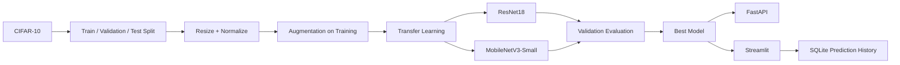
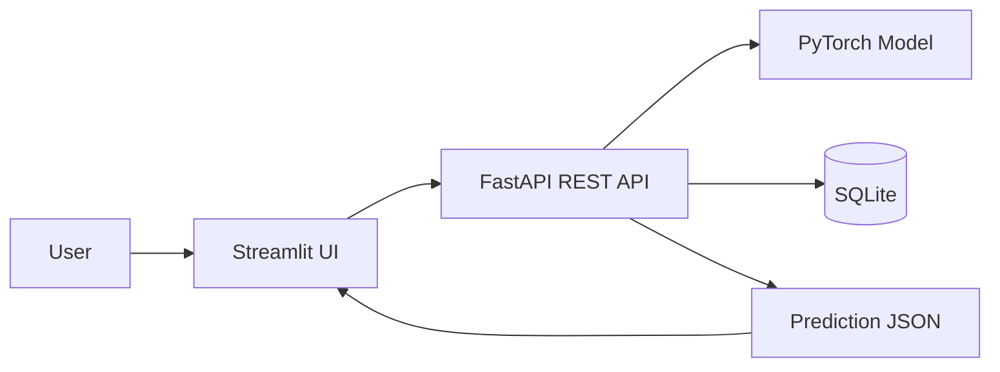

# AI-Powered Image Classification Platform

An end-to-end deep-learning image classification platform using **CIFAR-10**, transfer learning, REST APIs, Streamlit UI, prediction history, evaluation metrics, and technical documentation.

## Project highlights

- Public dataset: CIFAR-10 (10 object categories)
- Image preprocessing and augmentation
- Train/validation/test split
- Transfer learning comparison:
  - ResNet18
  - MobileNetV3-Small
- Metrics:
  - Accuracy
  - Precision
  - Recall
  - F1-score
  - Top-5 accuracy
  - Confusion matrix
- FastAPI REST API
- Streamlit frontend
- SQLite prediction history
- Saved PyTorch model
- Training/evaluation artifacts
- Docker configuration

## Dataset

CIFAR-10 contains 60,000 32×32 color images in 10 classes:
airplane, automobile, bird, cat, deer, dog, frog, horse, ship, truck.

Official dataset information:
https://www.cs.toronto.edu/~kriz/cifar.html

The training script downloads CIFAR-10 automatically with `torchvision`.

## Quick start

### 1. Create environment

```bash
python -m venv .venv
.venv\Scripts\activate
pip install -r requirements.txt
```

### 2. Train and compare models

For a CPU-friendly internship demo:

```bash
python scripts/train.py --epochs 3 --train-limit 10000 --val-limit 2000 --test-limit 2000
```

For a stronger run, remove the limits and increase epochs.

The script:
- downloads CIFAR-10
- creates train/validation/test splits
- applies augmentation
- fine-tunes ResNet18 and MobileNetV3-Small
- evaluates both
- selects the best model by validation accuracy
- saves the best model to `models/best_model.pt`
- writes metrics and confusion matrices to `reports/`

### 3. Start the API

```bash
python -m uvicorn api.main:app --reload
```

Open:
http://127.0.0.1:8000/docs

### 4. Start the frontend

Open a second terminal:

```bash
streamlit run app/streamlit_app.py
```

The browser UI lets you upload an image, see top predictions/confidence, and view prediction history.

## Project structure

```text
image_classification_platform/
├── app/
│   └── streamlit_app.py
├── api/
│   └── main.py
├── data/
│   └── README.md
├── models/
│   └── README.md
├── notebooks/
│   └── 01_experiments.md
├── reports/
│   └── README.md
├── scripts/
│   ├── train.py
│   ├── evaluate.py
│   └── make_report.py
├── src/
│   ├── __init__.py
│   ├── data.py
│   ├── models.py
│   ├── metrics.py
│   ├── database.py
│   └── inference.py
├── tests/
│   └── test_api.py
├── requirements.txt
├── Dockerfile
├── docker-compose.yml
└── README.md
```

## Data pipeline diagram



## Deployment architecture



## Important note

Pretrained ImageNet weights are downloaded by torchvision on the first training run. A network connection is therefore required for the initial training setup.

The trained model is intentionally generated locally by `scripts/train.py` rather than being fabricated. After training, commit `models/best_model.pt` and the generated `reports/` artifacts to GitHub.
